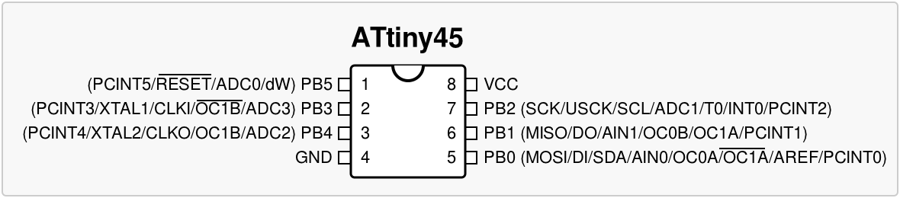
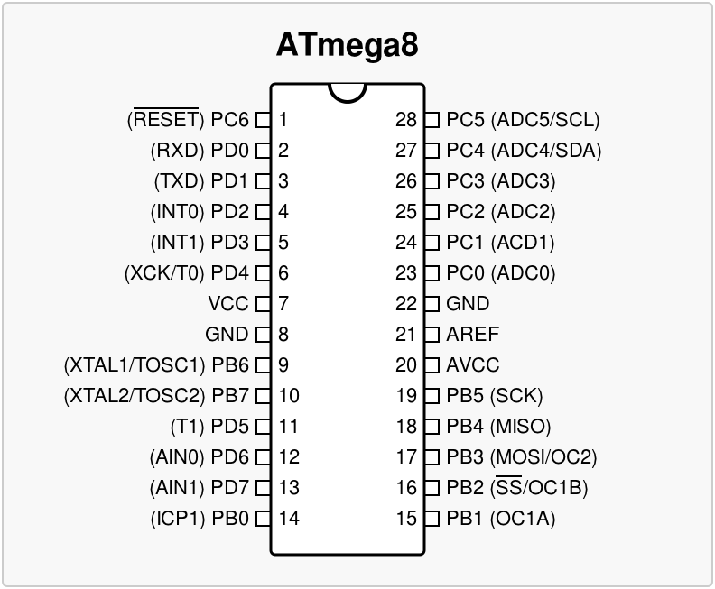
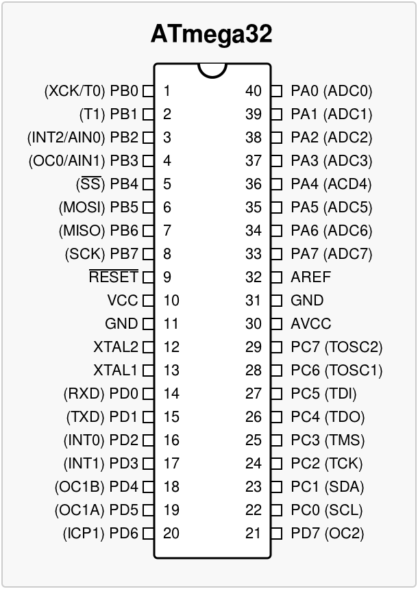

## Koppi's AVR projects

### Contents

* m8-led-blink - ATmega8 led blink
* m8-led-usart - ATmega8 usart
* m8-i2c-enc   - ATmega8 I2C rotary encoder

### Configure avrdude

To make avrdude work with your programmer, copy the file "avrduderc" to your home directory and adjust it to your needs:
```
$ cp avrduderc ~/.avrduderc
$ gedit avrduderc
```

## ATMEL datasheets

### ATtiny45



### ATtiny2313


### ATmega8



### ATmega32



## Copyright / Contact

Copyright GPL 2005-2012 by [Jakob Flierl](https://github.com/koppi)

